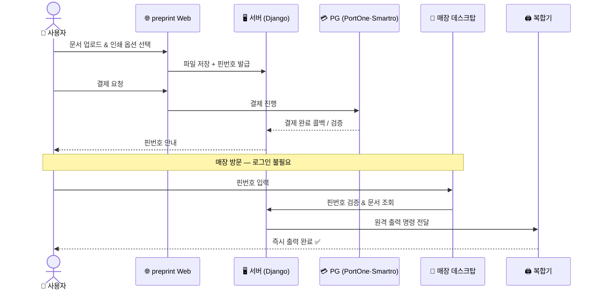
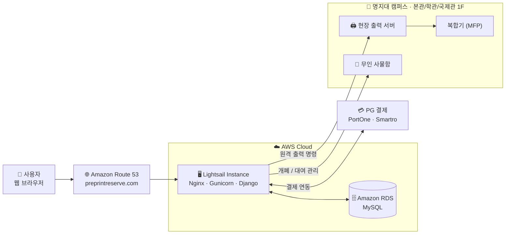

<!--
─────────────────────────────────────────────────────────────────────────────
  📌 이미지 추가 가이드 (이 주석은 GitHub에서 렌더링되지 않습니다)
─────────────────────────────────────────────────────────────────────────────
  아래 경로에 이미지를 넣고 파일명을 맞추면 그대로 표시됩니다.

  docs/images/
   ├─ logo.png              ← 로고 (투명 PNG 권장, 가로 220px 내외)
   ├─ banner.png            ← (선택) 상단 배너 이미지
   ├─ screen-reserve.png    ← 선결제·간편출력 메인 화면
   ├─ screen-locker.png     ← 사물함 대여/결제 화면
   ├─ screen-cloud.png      ← 클라우드 서비스 화면
   ├─ screen-payment.png    ← 결제 화면
   ├─ ops-1.png ~ ops-3.png ← 매장 운영 현장 사진 (본관/학관/국제관)
   ├─ team.png              ← 팀 사진 (없으면 대표자/개발 중 사진)
   └─ analytics.png         ← Google Analytics 대시보드 캡처
─────────────────────────────────────────────────────────────────────────────
-->

<div align="center">
  


# preprint · 프리프린트

### 대기 없이, 바로 출력. 교내 스마트 무인 출력 서비스

문서 업로드부터 결제·출력까지 — 로그인 없이 **핀번호 하나로 끝내는** 캠퍼스 출력 솔루션

<br/>

[](https://www.python.org/)
[](https://www.djangoproject.com/)
[](https://www.mysql.com/)
[](https://nginx.org/)
[](https://gunicorn.org/)
[](https://aws.amazon.com/)

<br/>

[**🌐 선결제·사물함 바로가기**](https://preprintreserve.com) &nbsp;·&nbsp;
[**☁️ 클라우드 바로가기**](https://preprintcloud.com) &nbsp;·&nbsp;
[**📖 이용 가이드**](https://preprintreserve.com/document_preprint_guide)

</div>

<br/>

<!-- docs/images/banner.png 가 있다면 아래 주석을 해제하세요
<div align="center">
  
</div>
-->

---

## 📑 목차

- [프리프린트란?](#-프리프린트란)
- [우리가 해결한 불편함](#-우리가-해결한-불편함)
- [서비스 구성](#-서비스-구성)
- [주요 기능](#-주요-기능)
- [동작 방식](#-동작-방식)
- [화면 미리보기](#-화면-미리보기)
- [운영 현장](#-운영-현장)
- [시스템 아키텍처](#-시스템-아키텍처)
- [기술 스택](#-기술-스택)
- [서비스 사용량](#-서비스-사용량)
- [연혁](#-연혁)
- [팀](#-팀)
- [링크 & 특허](#-링크--특허)

<br/>

## 🖨 프리프린트란?

> **프리프린트(preprint)** 는 *'대기 없이 바로 출력'* 할 수 있는 환경을 제공하는 **교내 스마트 출력 서비스**입니다.

재학 당시 학교 안에는 안정적인 출력 인프라가 부족했습니다. 학생들은 교외 프린트카페까지 5분 이상 이동해 긴 줄을 서서 출력해야 했고, 그 불편함을 직접 겪으며 *"교내에서, 줄 서지 않고, 안전하게 출력할 수는 없을까?"* 라는 질문에서 프리프린트가 시작되었습니다.

이 문제를 해결하기 위해 **무인 출력 서비스**를 교내에 도입하고, 여기에 **파일 클라우드**, **선결제·간편출력**, **무인 사물함 대여** 서비스를 자체 개발하여 **명지대학교 본관·학생회관·국제관 1층**에서 24시간 운영하고 있습니다. 웹을 통해 문서 업로드부터 결제까지 한 번에 처리할 수 있어, 반복적인 출력 과정을 효율적으로 단축합니다.

> [!NOTE]
> 이 저장소 **`pre-print-service`** 는 프리프린트 서비스 중 **선결제·간편출력 · 무인 사물함 대여 · 결제 연동(PortOne · Smartro)** 을 담당하는 **Django 기반 풀스택 프로젝트**입니다. ([preprintreserve.com](https://preprintreserve.com))

<br/>

## 💡 우리가 해결한 불편함

기존 무인 프린트 매장은 **보안이 취약하고 대기시간이 길다**는 구조적 문제가 있었습니다. 프리프린트는 이 과정을 다시 설계했습니다.

<table>
<tr>
<th width="50%">😣 기존 무인 프린트 방식</th>
<th width="50%">✨ 프리프린트 방식</th>
</tr>
<tr>
<td valign="top">

1. 출력할 파일을 **네이버 메일·카카오톡으로 미리 전송**
2. 매장 방문 후 **공용 계정에 로그인 → 파일 다운로드**
3. 현장에서 결제 후 출력

</td>
<td valign="top">

1. 웹에서 파일 업로드 → **핀번호 자동 발급 / 선결제**
2. 매장에서 **로그인 없이 핀번호만 입력**
3. **즉시 출력** (대기 0)

</td>
</tr>
<tr>
<td valign="top">

- 🔓 **보안 취약** — 공용 계정에 개인 파일 노출
- ⏳ **긴 대기시간** — 로그인·다운로드·결제 반복
- 🏃 **이동 부담** — 교외 프린트카페까지 5분+ 이동, 긴 줄

</td>
<td valign="top">

- 🔐 **로그인 불필요** — 핀번호 기반으로 개인정보 노출 최소화
- ⚡ **대기시간 단축** — 핀번호 입력 → 바로 출력
- 🏫 **교내 24시간** — 본관·학관·국제관 1층에서 즉시 이용

</td>
</tr>
</table>

<br/>

## 🧩 서비스 구성

프리프린트는 하나의 출력 경험을 위해 **4개의 서비스**를 함께 제공합니다.

| | 서비스 | 설명 |
|:---:|:---|:---|
| ☁️ | **파일 클라우드** | 출력할 파일을 핀번호와 매칭해 업로드하고, 매장에서 **로그인 없이 핀번호로 조회·출력** |
| 💳 | **선결제 · 간편출력** | 웹에서 **사전 결제** 후, 캠퍼스 복합기에서 **핀번호 입력만으로 즉시 출력** |
| 🔐 | **무인 사물함 대여** | 학생회관 1층 사물함을 **웹에서 직접 결제·대여** |
| 🖨️ | **무인 프린트 출력** | 본관·학관·국제관 1층 데스크탑 + 복합기로 **24시간 무인 출력** 지원 |

> 본 저장소는 위 서비스 중 **💳 선결제·간편출력**, **🔐 사물함 대여**, 그리고 두 서비스의 **결제 시스템**을 구현합니다.

<br/>

## ⭐ 주요 기능

- **🔑 핀번호 기반 무인 출력** — 회원가입·로그인 없이 핀번호 입력만으로 문서 조회 및 출력
- **💳 웹 선결제** — PG사(**PortOne · Smartro**) 연동을 통한 실시간 결제 및 결제 검증
- **🖨️ 원격 출력 제어** — 웹 결제 → **현장 출력 서버**로 인쇄 명령 전달 → 복합기 즉시 출력
- **🔐 무인 사물함 대여·결제** — 사물함 현황 조회, 결제, 대여 기간 관리
- **🏢 멀티 매장 운영** — 본관·학관·국제관 3개 거점의 출력/사물함 자원 통합 관리
- **📊 운영 데이터 관리** — 결제 내역·이용 현황 등 운영 데이터 적재 및 조회

<br/>

## 🔄 동작 방식

**선결제 · 간편출력** 의 전체 흐름입니다. 사용자는 매장에서 **로그인 없이 핀번호만** 입력하면 됩니다.



<br/>

## 🖥 화면 미리보기

> 실제 서비스 화면입니다.

<table>
<tr>
<td width="50%" align="center">
  <br/>
  <sub><b>선결제 · 간편출력</b></sub>
</td>
<td width="50%" align="center">
  <br/>
  <sub><b>무인 사물함 대여</b></sub>
</td>
</tr>
<tr>
<td width="50%" align="center">
  <br/>
  <sub><b>파일 클라우드</b></sub>
</td>
<td width="50%" align="center">
  <br/>
  <sub><b>결제 (PortOne · Smartro)</b></sub>
</td>
</tr>
</table>

<br/>

## 🏫 운영 현장

> 추가로, 명지대학교 **본관 · 학생회관 · 국제관 1층**에서 24시간 무인프린트를 운영 중입니다.

<table>
<tr>
<td width="33%" align="center">
  <br/>
  <sub><b>본관 1층</b></sub>
</td>
<td width="33%" align="center">
  <br/>
  <sub><b>학생회관 1층</b></sub>
</td>
<td width="33%" align="center">
  <br/>
  <sub><b>국제관 1층</b></sub>
</td>
</tr>
</table>

<br/>

## 🏗 시스템 아키텍처

웹 요청은 **Route 53 → Lightsail(Django) → RDS(MySQL)** 로 흐르며, 결제는 PG사와 연동되며 포트원, 스마트로사와 계약진행했습니다. 핵심은 **현장 출력 서버**로, 임대 매장의 기존 결제 시스템과 충돌하던 출력 환경을 우회하기 위해 캠퍼스 현장에 별도 서버를 구축하여 **원격 출력**을 가능하게 했습니다.



<br/>

## 🛠 기술 스택

<div align="center">

| 분류 | 기술 |
|:---:|:---|
| **Backend** |   |
| **Database** |   |
| **Infra / DevOps** |     |
| **Payment** |   |

</div>

```
🌐  Route 53            도메인 / DNS 관리
☁️  AWS Lightsail       애플리케이션 서버 (Nginx + Gunicorn + Django)
🗄️  Amazon RDS (MySQL)  관계형 데이터베이스
💳  PortOne · Smartro   실 결제 연동 및 결제 검증
🖨️  현장 출력 서버       원격 출력 명령 처리 (드라이버 충돌 우회 설계)
```

<br/>

## 📊 서비스 사용량

> Google Analytics 기준 · **2025.03 ~ 2026.03 (약 1년)**

<div align="center">

<table>
<tr>
<td align="center" width="25%">
  <h2>917</h2>
  <sub>누적 활성 사용자</sub>
</td>
<td align="center" width="25%">
  <h2>895</h2>
  <sub>신규 사용자</sub>
</td>
<td align="center" width="25%">
  <h2>21,000+</h2>
  <sub>이벤트 수</sub>
</td>
<td align="center" width="25%">
  <h2>3곳</h2>
  <sub>운영 거점</sub>
</td>
</tr>
</table>

<br/>

<!-- Google Analytics 대시보드 캡처 -->


</div>

<br/>

## 📅 연혁

<div align="center">

| 시기 | 마일스톤 |
|:---:|:---|
| `2022.11` | 🩵 **MJU 창업기술경진대회 최우수상** 수상 |
| `2022.12` | 🩵 **주식회사 노커(Knocker Inc.)** 설립 |
| `2023.10` | 🩵 명지대학교 학생회관 1층 **preprint 매장 오픈** |
| `2023.11` | 💜 **preprint Cloud Service** 개발 완료 및 운영 |
| `2023.12` | 💜 **특허 출원** — *원격 인쇄 서비스 시스템* |
| `2024.08` | 💛 **예약 출력 시스템** 개발 완료 |
| `2024.09` | 🩵 **본관 · 학관 · 국제관 1층** 3개 거점으로 확장 |
| `2025.03` | 💛 **무인 사물함 대여·결제 시스템** 개발 완료 및 운영 |
| `2025.09` | 🩵 **선결제 · 간편출력 서비스** 개발 완료 및 운영 |

<sub>🩵 사업 · 운영 &nbsp;|&nbsp; 💜 클라우드 · 특허 &nbsp;|&nbsp; 💛 개발</sub>

</div>

<br/>

## 👥 팀

<!-- docs/images/team.png (팀 사진 또는 개발 중 모습) 가 있다면 아래 주석을 해제하세요
<div align="center">
  
</div>
<br/>
-->

| 이름 | 역할 | 담당 |
|:---:|:---|:---|
| **이윤서** | 대표 · 서비스 기획 총괄 | 초기 아이디어 제안, 서비스 구조·UX·운영 프로세스 기획, 공간 확보 및 파트너사 협업 |
| **최은택** | 기술개발 총괄 팀장 | 전 서비스 프론트·백엔드 개발, AWS 클라우드 설계·구축, 서버 유지보수, PG 결제 연동 |
| **김의향** | UI/UX 디자인 *(~2025.11)* | Figma 기반 웹 UI/UX 설계, 사용자 인사이트 기반 홍보 기획 |

<br/>

## 🔗 링크 & 특허

| | |
|:---|:---|
| 🌐 **선결제 · 사물함** | [preprintreserve.com](https://preprintreserve.com) |
| ☁️ **파일 클라우드** | [preprintcloud.com](https://preprintcloud.com) |
| 📖 **선결제·간편출력 이용 가이드** | [document_preprint_guide](https://preprintreserve.com/document_preprint_guide) |
| 📖 **사물함 이용 가이드** | [document_locker_main](https://preprintreserve.com/document_locker_main) |
| 📜 **특허** | 원격 인쇄 서비스 시스템 *(2023.12 출원)* |

<br/>

---

<div align="center">

**프리프린트는 명지대 학우분들의 대기시간을 줄이고, 더 편리한 출력 경험을 만들어 갑니다.**

앞으로도 더 편리하고 대기 없는 출력을 위해 끊임없이 개선해 나가겠습니다.
창업·협업 제안은 언제나 환영입니다 🙌

<br/>

<sub>© 2023–2026 주식회사 노커(Knocker Inc.) · preprint. All rights reserved.</sub>

</div>
